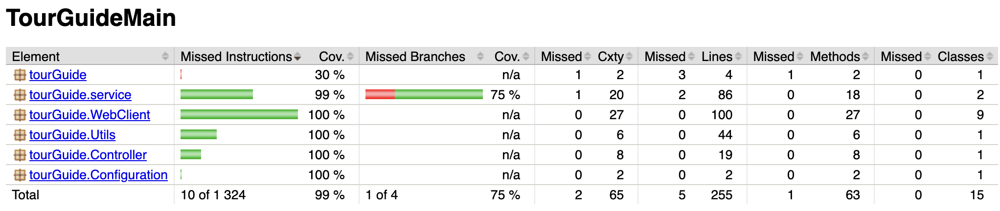
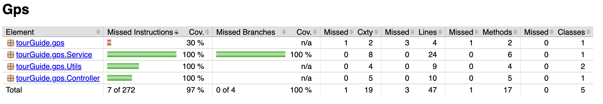
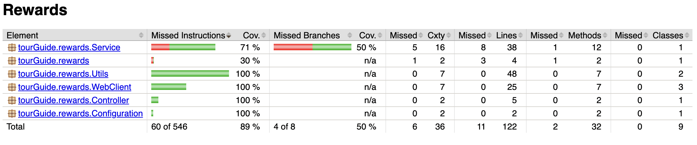
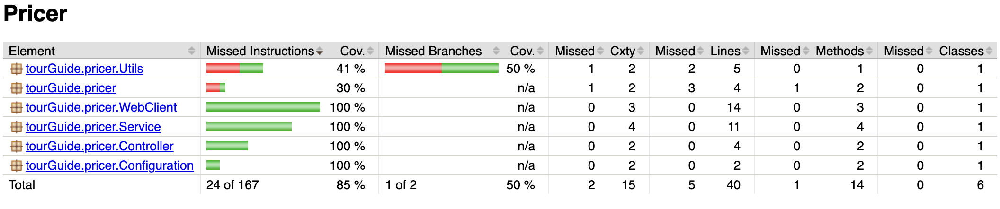

<p align="center">
 * * *    * * *  
</p>

# OpenClassrooms Application Developer Java Project 8


## TourGuide App

TourGuide is a Spring Boot application that has been a centerpiece in the TripMasters app portfolio. The application will be targeting people looking for package deals on hotel stays and admissions to various attractions.

It now supports the tracking of 100.000 users in a bit less than 3 minutes and the calculation of reward points for 100.000 users in +-3 minutes.

## Project Architecture


## Run the app
First, build all jar, in each microservice run :
```
$./gradlew bootJar
```
Then run docker :
```
$ docker-compose up
```
## Testing
To generate jacoco reports and tests, in each microservice run (all microservices must be started) :
```
$ ./gradlew jacocoTestReport
```

## Swagger documentation :
<ul>
<li><b>TourGuideMain : </b>http://localhost:8080/swagger-ui/index.html</li>
<li><b>Gps : </b>http://localhost:8081/swagger-ui/index.html</li>
<li><b>User : </b>http://localhost:8082/swagger-ui/index.html</li>
<li><b>Reward : </b>http://localhost:8083/swagger-ui/index.html</li>
<li><b>Pricer : </b>http://localhost:8084/swagger-ui/index.html</li>
</ul>

## Performances : 


## Test reports :

### TourGuideMain : 


### Gps :


### User :


### Rewards :


### Pricer :


### Disclaimer
<p>This is a school project, I made a mistake configuring my .git & .gitignore file which made it impossible to push to github.</p>
<p>A new .git file has been initialized with the right gitignore in order to be able to push on github.</p>

<p>Screenshots of the history of my project can be seen in</p>

```
/GitHistory_Screenshots
```